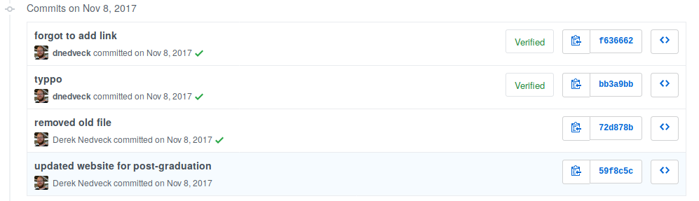

```{r setup, include=FALSE}
knitr::opts_chunk$set(echo = FALSE)
```

## My context

- using Linux since 2009, R since 2012
- got into static sites in 2012 for a personal blog, also lab notebook for grad school
- I don't know much about HTML / CSS / Javascript, etc. 

## Overview

- what are static site generators
- static site use cases
- live demo

# Static site generators

## First, dynamic websites

- dynamically generated content
- processes run on servers
- servers generate content at each request, and serve for each user
- eventually web server software gets clever and caches pages 

## Downsides to dynamic sites

- servers need to generate content for each request
- server software could have security issues (need to manage updates)
- \$\$\$ to run a server

## What if we didn't dynamically generate our sites?


## Thinking more on this

What if we just serve the cached pages? Is there a way to get around the cases where there's dynamic content being generated?

What about the use cases that don't need dynamic content (e.g. businesses, portfolios ... ) ??


## Static site generators

- generate websites using templates from input files (usually `.md`)
- hosted on low-power infrastructure
- bonus points: host on AWS, Dropbox, GitHub ... 

## Static sites trying to be dynamic

- user comments? 
- Disqus -- but the data is no longer tied to your site
- [Staticman](https://staticman.net/) uses a git flow, but I hope your site isn't popular or hit with a lot of spam

## Me and static sites

- started with Pelican
- then Jekyll because of GitHub integration
- edit site source and push to GitHub to build site 

## Me and static sites

- started with Pelican
- then Jekyll because of GitHub integration
- edit site source and push to GitHub to build site 

`git push --yolo`



## Enter: blogdown

Nice, a static site generator that is in a language that I already have a dev env for, and I was looking at incorporating my R work into a blog anyway. 

## So what is blogdown?

- R package
- pandoc to convert .md -> html, hugo to render site
- includes functionality for .Rmd processing (knitr)
- ties into RStudio (Addins)

# Static site use cases

## Default

- blog
- business website
- portfolio
- project documentation

## Personal knowledgebase

One of my personal projects is creating a knowledge base -- how can a I collect and *curate* knowledge? Some of my needs for this project are: 

- store my notes
- categories of stuff
- tagging system (organizing files into folders breaks down when something touches on multiple topics)
- be able to interact with it as a file system
- view it without internet connection


## Personal knowledgebase


A static site generator ticks these boxes.

Bonus points: I can write in .Rmd


## Work notebook

While I work ...

- what code is being run
- results generated
- what am I thinking about results

plus ...

- troubleshooting things

## Work notebook

Now, I'm using blogdown for a work notebook, and it's great so far. Fairly low-friction system, and it meets pretty much all of my needs. 


Also search for 'open lab notebook' for more on this, and see [Carl Boettiger's lab notebook](https://www.carlboettiger.info/lab-notebook) as well. 

FYI: [workflowr](https://jdblischak.github.io/workflowr/)


## What's the incentive to use blogdown?


- make a blog for online use (maybe portfolio, business site?)
- organize and view personal notes
- use as a notebook for analysis / work

And do all of this in an R-centric way


# demo tour

## Ok, let's work through some demos

- make a blogdown project
- tour of the directory
- import a new theme
- host on Netlify

## If the demos didn't work

A great way is to learn by doing ... and the blogdown documentation is pretty good. 